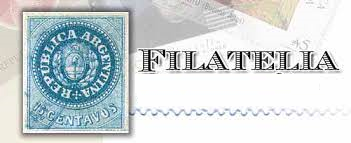

# Santapaola-Filatelia-

## La idea es crear un e-commerce en el que se puedan ofrecer productos vinculados a la Filatelia Argentina. 
### Los principales productos serán:
        * Sellos postales.
        * Sobres primer día.
        * Enteros postales.
        * Reseñas filatelicas.
        * Albunes y Carpetas.
        * Productos especiales.
### Cada producto estará conformado por un titulo, una breve reseña, tamaño, Precio y fecha de emisión
     
##  **Público Objetivo :**
     Esta dirigida a personas mayores a 15 años.

##  **Tipografia Principal:** 
    * Tahoma.
    * Verdana.
    * Arial.

##  **Paleta de colores:**

    
## **Logo**

## **Boceto Figma**

